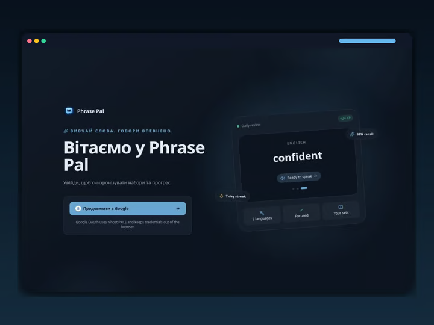

# Phrase Pal

**Live demo:** [phrase-pal-olive.vercel.app](https://phrase-pal-olive.vercel.app)



Phrase Pal is a Next.js app for learning words and phrases with spaced review, synced sets and progress via Nhost with Google sign-in.

## Stack

- Next.js 16 (App Router), React 19, TypeScript
- Tailwind CSS v4, tw-animate-css, Lucide icons
- Nhost (Postgres + Hasura GraphQL, Auth) with Google OAuth via PKCE
- React Hook Form + Zod for form validation
- ESLint + Prettier

## Local development

```bash
pnpm install
pnpm dev
```

See [NHOST_SETUP.md](NHOST_SETUP.md) for backend and OAuth setup.
